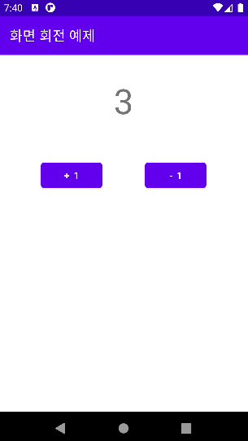
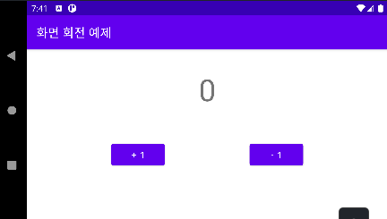

## 화면 회전 예제(Activity 회전에도 상태 저장하기)

### Activity의 상태 저장이 필요한 이유

**Activity가 종료될 수 있는 상황들**

1. 뒤로가기 키 혹은 onBackPressed()가 호출되는경우
2. finish() 메소드 혹은 관련 메소드 실행시
3. 시스템으로 인한 종료.

이 중에서 3번을 자세하게 알아보면

Android OS에서 모든 앱은 우선순위가 있습니다. 기본 제공하는 전화,카메라와 같은 앱도 우리가 만드는 앱과 동일한 레벨이지만 기본 앱은 시스템 권한을 사용할 수 있고 우선순위가 높은 차이가 있습니다.

우리가 만드는 앱에는 현재 사용자가 사용하고있는 앱(포그라운드 앱)일 수록 우선순위가 높고
우리가 사용하지 않고(백그라운드)있는 앱은 우선순위가 낮습니다.

이러한 우선순위란 앱을 사용함에 있어 사용하는 기기에서 메모리가 부족할때 강제 종료하는 앱을 정하는 기준이라고 보면 이해하기 쉽습니다.

예를 들어 지금 사용자가 사용하는 앱을 시스템이 강제 종료해선 안되겠죠?
반대로 백그라운드에서 돌고있는 앱은 언제든 시스템이 메모리가 부족할때 강제 종료하여 부족한 메모리를
받아올 수 있습니다.
그러나 백그라운드에 있어도 전화앱 자체가 죽어버리면 안되겠죠?

이러한 상황에서 Android OS는 각 앱이라는 프로세스에 우선순위를 지정하여 관리합니다.

또한 화면을 회전할 경우에도 Activity가 onDestroy가 호출되고 onCreate가 호출되며 재 실행됩니다.

위와 같은 경우에 Activity 상태 저장이 필요합니다.

---

상태 저장 없이 화면을 회전시켜본다면 아래와 같은 일이 벌어집니다.

<table>
    <tr>
        <td>
            <center>
           					</center>
        </td>
        <td>
            <center>
            	
            </center>
        </td>
    </tr>
</table>

화면 회전시 생명주기 로그를 찍어보면 다음과 같습니다.

```
// Activity 실행
D/[Lifecycle]MainActivity: onCreated
D/[Lifecycle]MainActivity: onStart
D/[Lifecycle]MainActivity: onResume

// 화면 회전
D/[Lifecycle]MainActivity: onPause
D/[Lifecycle]MainActivity: onStop
D/[Lifecycle]MainActivity: onSaveInstanceState
D/[Lifecycle]MainActivity: onDestroy
D/[Lifecycle]MainActivity: onCreated
D/[Lifecycle]MainActivity: onStart
D/[Lifecycle]MainActivity: onResume

```

위와 같이 Destroy가 호출됨으로 TextView에 노출되던 데이터 상태를 잃어버리게 됩니다.

그렇다면 우리는 이 데이터 상태를 잃지 않기 위해서는 데이터를 어떤 곳에

저장하고, 복원할 수 있어야 합니다.

---

위 생명주기 로그를 보면 신기한 이름이 하나 있습니다.

`onSaveInstanceState` 이름부터 어떤 상태를 저장하고 아래 그림을 보면


사진 출처:[The Android Lifecycle cheat sheet — part I: Single Activities | by Jose Alcérreca | Android Developers | Medium](https://medium.com/androiddevelopers/the-android-lifecycle-cheat-sheet-part-i-single-activities-e49fd3d202ab)

`onSaveInstanceState()` 라는 친구에서 무언가 저장하고
`onRestoreInstanceState()`라는 친구에서 무언가 복구할것이라 예측할 수 있습니다.

---

`onSaveInstanceState()` 라는 친구 아래와 같이 데이터를 저장할 수 있습니다.

<iframe   src="https://carbon.now.sh/embed?bg=rgba%28255%2C255%2C255%2C0%29&t=one-dark&wt=none&l=auto&ds=true&dsyoff=20px&dsblur=68px&wc=true&wa=true&pv=56px&ph=56px&ln=false&fl=1&fm=Hack&fs=14px&lh=133%25&si=false&es=2x&wm=false&code=%2520%2520%2520%2520%252F*%2520%25EC%2597%2591%25ED%258B%25B0%25EB%25B9%2584%25ED%258B%25B0%25EA%25B0%2580%2520%25ED%2599%2594%25EB%25A9%25B4%2520%25ED%259A%258C%25EC%25A0%2584%2520%25ED%2598%25B9%25EC%259D%2580%2520%25EC%259E%25AC%25EC%258B%25A4%25ED%2596%2589%25EC%258B%259C%2520%25EC%2596%25B4%25EB%2596%25A4%2520%25EB%258D%25B0%25EC%259D%25B4%25ED%2584%25B0%2520%25EC%2583%2581%25ED%2583%259C%25EB%25A5%25BC%2520%25EC%25A0%2580%25EC%259E%25A5%25ED%2595%25B4%25EC%2595%25BC%25ED%2595%25A0%25EB%2595%258C%2520%25ED%2598%25B8%25EC%25B6%259C%25ED%2595%2598%25EB%258A%2594%2520%25EC%2583%259D%25EB%25AA%2585%25EC%25A3%25BC%25EA%25B8%25B0%250A%2520%2520%2520%2520*%2520%25EC%2597%2591%25ED%258B%25B0%25EB%25B9%2584%25ED%258B%25B0%25EA%25B0%2580%2520Destroy%2520%25EB%2590%2598%25EA%25B8%25B0%2520%25EC%25A0%2584%25EC%2597%2590%2520%25ED%2598%25B8%25EC%25B6%259C%25EB%2590%259C%25EB%258B%25A4.*%252F%250A%2520%2520%2520%2520override%2520fun%2520onSaveInstanceState%28outState%253A%2520Bundle%29%2520%257B%250A%2520%2520%2520%2520%2520%2520%2520%2520%252F%252F%2520bundle%2520%25EC%259D%25B4%25EB%259D%25BC%25EB%258A%2594%2520%25EC%2583%2581%25EC%259E%2590%25EC%2597%2590%2520%25EB%258D%25B0%25EC%259D%25B4%25ED%2584%25B0%25EB%25A5%25BC%2520%25EC%25A0%2580%25EC%259E%25A5%250A%2520%2520%2520%2520%2520%2520%2520%2520%252F%252F%2520intent%2520%25EA%25B0%2580%2520%25EB%258D%25B0%25EC%259D%25B4%25ED%2584%25B0%25EB%25A5%25BC%2520%25EC%25A0%2584%25EB%258B%25AC%25ED%2595%2598%25EB%258A%2594%2520%25EC%2588%2598%25EB%258B%25A8%25EC%259D%25B4%25EB%259D%25BC%25EB%25A9%25B4%2520bundle%2520%25EC%259D%2580%2520%25EA%25B7%25B8%2520%25EB%258D%25B0%25EC%259D%25B4%25ED%2584%25B0%25EB%25A5%25BC%2520%25EC%25A0%2580%25EC%259E%25A5%25ED%2595%2598%25EB%258A%2594%2520%25EC%2583%2581%25EC%259E%2590%250A%2520%2520%2520%2520%2520%2520%2520%2520%252F%252F%2520bundle%2520%25EC%259D%2580%2520%25EC%2597%25AC%25EB%259F%25AC%25EA%25B0%2580%25EC%25A7%2580%2520%25ED%2583%2580%25EC%259E%2585%25EC%259D%2584%2520%25EC%25A0%2580%25EC%259E%25A5%25ED%2595%2598%25EB%258A%2594%2520MAP%2520%25ED%2581%25B4%25EB%259E%2598%25EC%258A%25A4%250A%2520%2520%2520%2520%2520%2520%2520%2520outState.putInt%28%2522score%2522%252C%2520score%29%250A%2520%2520%2520%2520%2520%2520%2520%2520super.onSaveInstanceState%28outState%29%250A%2520%2520%2520%2520%257D"   style="width: 812px; height: 348px; border:0; transform: scale(1); overflow:hidden;"   sandbox="allow-scripts allow-same-origin"> </iframe>

데이터의 복구는 다음과 같이 할 수 있습니다. onCreate는 Activity의 첫 실행지점이면서 시스템에 의해 종료되 재성성시 시작되는 위치이므로 매개변수로 savedInstanceState를 가지고 있습니다.
해당 데이터가 있을 경우 받아오고 아닐경우 기존 값을 보내는 부분을 추가할 수 있습니다.

<iframe   src="https://carbon.now.sh/embed?bg=rgba%28171%2C+184%2C+195%2C+1%29&t=one-dark&wt=none&l=auto&ds=true&dsyoff=20px&dsblur=68px&wc=true&wa=true&pv=56px&ph=56px&ln=false&fl=1&fm=Hack&fs=14px&lh=133%25&si=false&es=2x&wm=false&code=%2520%2520%2520%2520override%2520fun%2520onCreate%28savedInstanceState%253A%2520Bundle%253F%29%2520%257B%250A%2520%2520%2520%2520%2520%2520%2520%2520super.onCreate%28savedInstanceState%29%250A%2520%2520%2520%2520%2520%2520%2520%2520setContentView%28binding.root%29%250A%2520%2520%2520%2520%2520%2520%2520%2520%252F%252F%2520%25ED%2595%2598%25EB%258B%25A8%25EC%2597%2590%25EC%2584%259C%2520%25EC%25A0%2580%25EC%259E%25A5%25ED%2595%259C%2520bundle%2520%25EC%259D%2584%2520onCreate%2520%25EC%2597%2590%25EC%2584%259C%2520%25EA%25B0%2580%25EC%25A0%25B8%25EC%2598%25AC%2520%25EC%2588%2598%2520%25EC%259E%2588%25EB%258B%25A4.%250A%2520%2520%2520%2520%2520%2520%2520%2520%252F*%25EB%25A7%258C%25EC%2595%25BD%2520%25EC%25A0%2580%25EC%259E%25A5%25EB%2590%259C%2520bundle%2520%25EC%259D%25B4%2520%25EC%259E%2588%25EB%258B%25A4%25EB%25A9%25B4%2520%25EA%25B0%2580%25EC%25A0%25B8%25EC%2598%25A4%25EA%25B3%25A0%2520%25EC%2597%2586%25EC%259C%25BC%25EB%25A9%25B4%2520%25EC%25B4%2588%25EA%25B8%25B0%2520score%2520%25EA%25B0%2592%25EC%259D%2584%2520%25EC%25A0%2584%25EB%258B%25AC%25ED%2595%259C%25EB%258B%25A4.*%252F%250A%2520%2520%2520%2520%2520%2520%2520%2520score%2520%253D%2520savedInstanceState%253F.getInt%28%2522score%2522%29%2520%253F%253A%25200%250A%2520%2520%2520%2520%2520%2520%2520%2520initView%28score%29%250A%2520%2520%2520%2520%2520%2520%2520%2520setClickEvent%28%29%250A%2520%2520%2520%2520%257D"   style="width: 773px; height: 348px; border:0; transform: scale(1); overflow:hidden;"   sandbox="allow-scripts allow-same-origin"> </iframe>

<iframe   src="https://carbon.now.sh/embed?bg=rgba%28171%2C+184%2C+195%2C+1%29&t=one-dark&wt=none&l=auto&ds=true&dsyoff=20px&dsblur=68px&wc=true&wa=true&pv=56px&ph=56px&ln=false&fl=1&fm=Hack&fs=14px&lh=133%25&si=false&es=2x&wm=false&code=%250A%2520%2520%2520%2520%252F%252FonCreate%2520%25EC%2597%2590%25EC%2584%259C%2520null%2520check%2520%25EB%25A5%25BC%2520%25ED%2595%2598%25EC%25A7%2580%2520%25EC%2595%258A%25EA%25B3%25A0%2520%25EC%258B%25B6%25EB%258B%25A4%25EB%25A9%25B4%2520%25EC%2595%2584%25EB%259E%2598%2520%25EB%25B0%25A9%25EB%25B2%2595%25EC%259C%25BC%25EB%25A1%259C%2520%25EC%2582%25AC%25EC%259A%25A9%25ED%2595%2598%25EB%258A%2594%2520%25EB%25B0%25A9%25EB%25B2%2595%25EB%258F%2584%2520%25EC%259E%2588%25EB%258B%25A4.%250A%250A%2520%2520%2520%2520override%2520fun%2520onRestoreInstanceState%28savedInstanceState%253A%2520Bundle%29%2520%257B%250A%2520%2520%2520%2520%2520%2520%2520%2520super.onRestoreInstanceState%28savedInstanceState%29%250A%2520%2520%2520%2520%2520%2520%2520%2520binding.scoreText.text%2520%253D%2520savedInstanceState.getInt%28%2522score%2522%29.toString%28%29%250A%2520%2520%2520%2520%257D%250A"   style="width: 808px; height: 330px; border:0; transform: scale(1); overflow:hidden;"   sandbox="allow-scripts allow-same-origin"> </iframe>