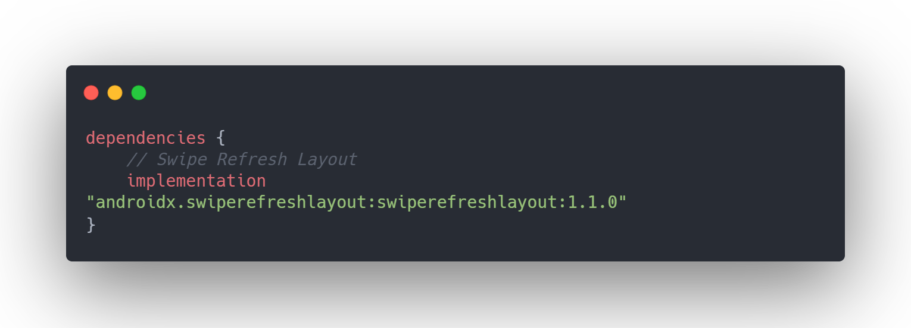

# Swipe refresh Layout 예제

#### 사용되는 경우

사용자가 업데이트를 요청할 경우.


### 사용 방법 

#### 1. build.gradle(Module:app)에 종속성 추가하기



[코드 복사용 링크](https://carbon.now.sh/?bg=rgba%28171%2C184%2C195%2C0%29&t=one-dark&wt=none&l=groovy&ds=true&dsyoff=20px&dsblur=68px&wc=true&wa=true&pv=56px&ph=56px&ln=false&fl=1&fm=Hack&fs=14px&lh=133%25&si=false&es=2x&wm=false&code=dependencies%2520%257B%250A%2520%2520%2520%2520%252F%252F%2520Swipe%2520Refresh%2520Layout%250A%2520%2520%2520%2520implementation%2520%2522androidx.swiperefreshlayout%253Aswiperefreshlayout%253A1.1.0%2522%250A%250A%257D)

#### 2. xml 작성하기

```xml
<?xml version="1.0" encoding="utf-8"?>
<androidx.swiperefreshlayout.widget.SwipeRefreshLayout
    android:id="@+id/score_refresh_view"
    xmlns:android="http://schemas.android.com/apk/res/android"
    xmlns:app="http://schemas.android.com/apk/res-auto"
    xmlns:tools="http://schemas.android.com/tools"
    android:layout_width="match_parent"
    android:layout_height="match_parent"
    tools:context=".MainActivity">

    <androidx.constraintlayout.widget.ConstraintLayout
        android:layout_width="match_parent"
        android:layout_height="match_parent">

        ...


    </androidx.constraintlayout.widget.ConstraintLayout>
</androidx.swiperefreshlayout.widget.SwipeRefreshLayout>

```

전체적인 뷰 자체를 Refresh 하기위해 root View를 SwipeRefreshLayout으로 구성했습니다.

`swiperefreshlayout`의 경우는 내부에 자식 뷰를 하나만 허용하여 내부를 `ConstraintLayout`으로 묶어 처리했습니다.


#### 3. 코드 작성하기

```kotlin
package org.sopt.swiperefreshlayout

import android.os.Bundle
import androidx.appcompat.app.AppCompatActivity
import org.sopt.swiperefreshlayout.databinding.ActivityMainBinding

class MainActivity : AppCompatActivity() {
    //...

    override fun onCreate(savedInstanceState: Bundle?) {
        super.onCreate(savedInstanceState)
        setContentView(binding.root)
        //...
        initView(score)
        setClickEvent()
    }

    private fun initView(savedScore: Int) {
        with(binding) {
            scoreText.text = savedScore.toString()
            // RefreshView로 Refresh 가 필요한 부분의 뷰를 감싸고 이벤트를 지정한다.
            scoreRefreshView.setOnRefreshListener { onRefreshEvent() }
        }
    }

    /*뷰가 Refresh 될때
    * 스코어는 초기화 하고
    * 해당 스코어 택스트를 업데이트하며
    * 리프레시 상태를 false 로 만들어준다.*/
    private fun onRefreshEvent() {
        score = 0
        updateScoreText()
        binding.scoreRefreshView.isRefreshing = false
    }

    //...
}

```

어려운 부분이 없습니다! 그냥 클릭 이벤트 달아주듯 이벤트를 넣어주면 됩니다!