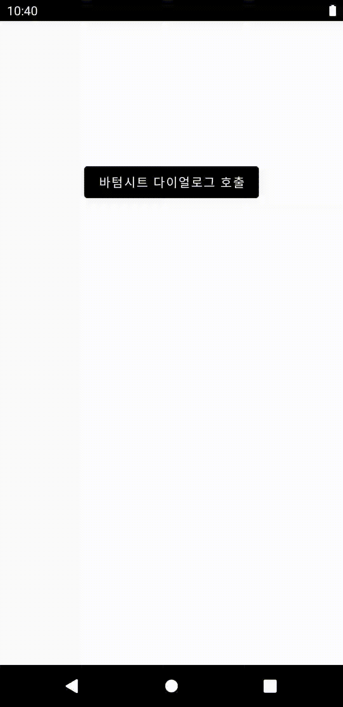

# Bottom Sheet Dialog 예제

[](https://github.com/mdb1217)

#### 사용되는 경우

하단에 띄워지는 다이얼로그를 구현하고 싶을 때

<br>

#### 구현 화면



<br>

### 사용 방법 

#### 1. BottomSheetDialogFragment()를 상속하는 클래스 작성

```kotlin
class CustomBottomSheetDialog : BottomSheetDialogFragment() {
    private lateinit var binding : LayoutCustomBottomSheetBinding
    private var callbackButtonClickListener: (() -> Unit?)? = null

    //Bottom Sheet Dialog 구현부분
    override fun onCreateView(
        inflater: LayoutInflater,
        container: ViewGroup?,
        savedInstanceState: Bundle?
    ): View? {
        binding = LayoutCustomBottomSheetBinding.inflate(inflater, container, false)

        binding.clButton1.setOnClickListener { makeAlertDialog("버튼1", "버튼1이 클릭 되었습니다!") }
        binding.clButton2.setOnClickListener { makeAlertDialog("버튼2", "버튼2가 클릭 되었습니다!") }
        binding.clCallback.setOnClickListener {
            callbackButtonClickListener?.invoke()
            dismiss()
        }
        binding.clExit.setOnClickListener { dismiss() }

        return binding.root
    }

  	//콜백 setter
    fun setCallbackButtonClickListener(listener: () -> Unit) {
        this.callbackButtonClickListener = listener
    }

  	//AlertDialog 만드는 함수
    private fun makeAlertDialog(title : String, message : String) {
        val builder = AlertDialog.Builder(requireContext())
        builder.apply {
            setTitle(title)
            setMessage(message)
            setPositiveButton(
                "확인"
            ) { _: DialogInterface?, _: Int -> }
            setNegativeButton("취소") { _: DialogInterface?, _: Int ->  }
        }.show()
    }
}
```

<br>

#### 2. Dialog의 Custom Layout 만들기(xml 파일 작성)

```xml
<?xml version="1.0" encoding="utf-8"?>
<layout xmlns:tools="http://schemas.android.com/tools"
    xmlns:app="http://schemas.android.com/apk/res-auto"
    xmlns:android="http://schemas.android.com/apk/res/android">

    <data>

    </data>

    <androidx.constraintlayout.widget.ConstraintLayout
        android:paddingVertical="32dp"
        android:layout_width="match_parent"
        android:layout_height="wrap_content">

        <androidx.constraintlayout.widget.ConstraintLayout
            android:id="@+id/cl_button1"
            android:layout_width="match_parent"
            android:layout_height="wrap_content"
            app:layout_constraintTop_toTopOf="parent">

            <TextView
                android:id="@+id/tv_button1"
                android:layout_width="wrap_content"
                android:layout_height="wrap_content"
                android:text="버튼1"
                app:layout_constraintBottom_toBottomOf="parent"
                app:layout_constraintEnd_toEndOf="parent"
                app:layout_constraintStart_toStartOf="parent"
                app:layout_constraintTop_toTopOf="parent" />
        </androidx.constraintlayout.widget.ConstraintLayout>

        <androidx.constraintlayout.widget.ConstraintLayout
            android:id="@+id/cl_button2"
            android:layout_width="match_parent"
            android:layout_height="wrap_content"
            android:layout_marginTop="16dp"
            app:layout_constraintTop_toBottomOf="@+id/cl_button1">

            <TextView
                android:id="@+id/tv_button2"
                android:layout_width="wrap_content"
                android:layout_height="wrap_content"
                android:text="버튼2"
                app:layout_constraintBottom_toBottomOf="parent"
                app:layout_constraintEnd_toEndOf="parent"
                app:layout_constraintStart_toStartOf="parent"
                app:layout_constraintTop_toTopOf="parent" />
        </androidx.constraintlayout.widget.ConstraintLayout>

        <androidx.constraintlayout.widget.ConstraintLayout
            android:id="@+id/cl_callback"
            android:layout_width="match_parent"
            android:layout_height="wrap_content"
            android:layout_marginTop="16dp"
            app:layout_constraintTop_toBottomOf="@+id/cl_button2">

            <TextView
                android:id="@+id/tv_callback"
                android:layout_width="wrap_content"
                android:layout_height="wrap_content"
                android:text="콜백 버튼"
                app:layout_constraintBottom_toBottomOf="parent"
                app:layout_constraintEnd_toEndOf="parent"
                app:layout_constraintStart_toStartOf="parent"
                app:layout_constraintTop_toTopOf="parent" />
        </androidx.constraintlayout.widget.ConstraintLayout>

        <View
            android:id="@+id/line"
            android:layout_width="match_parent"
            android:layout_height="1dp"
            android:layout_marginHorizontal="16dp"
            android:layout_marginTop="17dp"
            android:background="#F2F2F2"
            app:layout_constraintEnd_toEndOf="parent"
            app:layout_constraintStart_toStartOf="parent"
            app:layout_constraintTop_toBottomOf="@+id/cl_callback" />

        <androidx.constraintlayout.widget.ConstraintLayout
            android:id="@+id/cl_exit"
            android:layout_width="match_parent"
            android:layout_height="wrap_content"
            android:layout_marginTop="24dp"
            app:layout_constraintTop_toBottomOf="@+id/line">

            <TextView
                android:id="@+id/tv_exit"
                android:layout_width="wrap_content"
                android:layout_height="wrap_content"
                android:text="나가기 버튼"
                app:layout_constraintBottom_toBottomOf="parent"
                app:layout_constraintEnd_toEndOf="parent"
                app:layout_constraintStart_toStartOf="parent"
                app:layout_constraintTop_toTopOf="parent" />
        </androidx.constraintlayout.widget.ConstraintLayout>

    </androidx.constraintlayout.widget.ConstraintLayout>
</layout>
```

<br>

#### 3. Dialog를 사용할 뷰(Activity나 Fragment)에 다이얼로그 띄워주는 코드 작성하기

```kotlin
class MainActivity : AppCompatActivity() {
    private lateinit var binding : ActivityMainBinding
    override fun onCreate(savedInstanceState: Bundle?) {
        super.onCreate(savedInstanceState)
        binding = DataBindingUtil.setContentView(this, R.layout.activity_main)

        initClickEvent()
    }

    private fun makeBottomSheetDialog() {
        val customBottomSheetDialog = CustomBottomSheetDialog()
      	//callback 코드 작성
        customBottomSheetDialog.setCallbackButtonClickListener {
            startActivity(Intent(this@MainActivity, ResultActivity::class.java))
        }
        customBottomSheetDialog.show(supportFragmentManager, "custom")
    }

    private fun initClickEvent() {
        binding.btnDialog.setOnClickListener {
            makeBottomSheetDialog()
        }
    }
}
```

